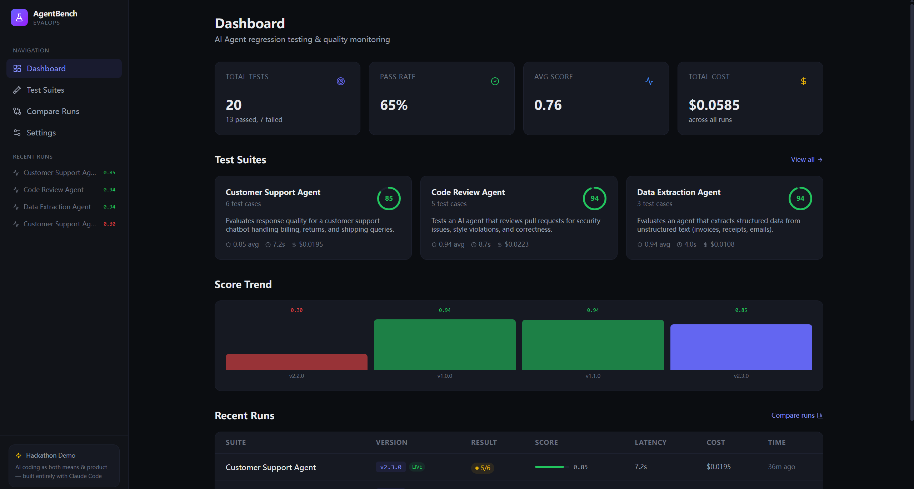
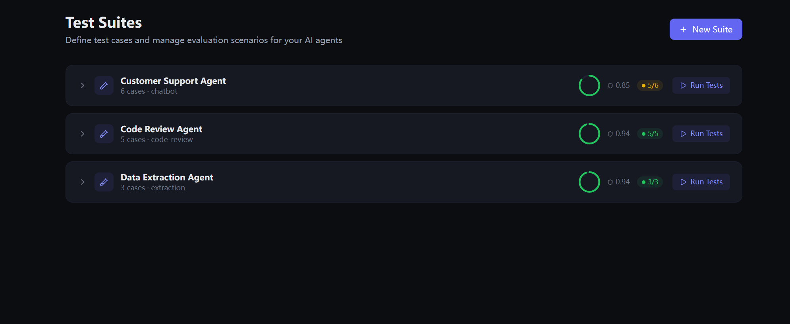
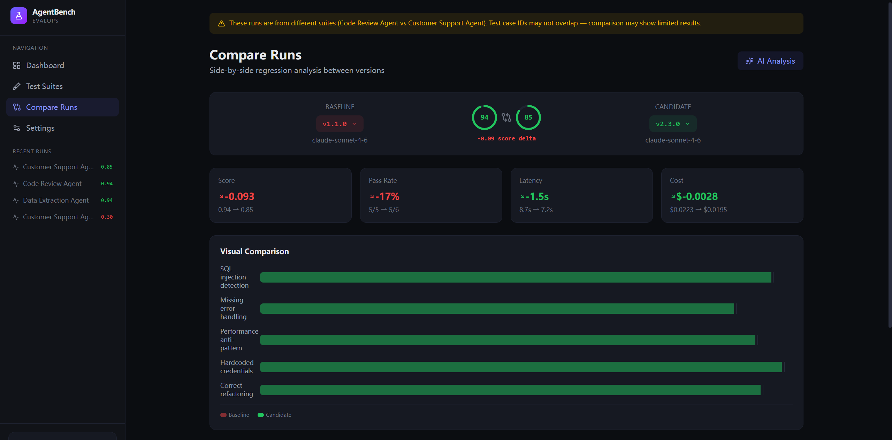

# AgentBench — AI Agent EvalOps Platform

[English](README.md) | [中文](README.zh.md)

> Regression testing, drift detection, and quality assurance for AI agents.
> **Built entirely with Claude Code** — AI coding as both the means and the product.

> ⚠️ **Naming Notice**: This project is **not affiliated** with [THUDM/AgentBench](https://github.com/THUDM/AgentBench), the academic benchmark for evaluating LLM-as-Agent capabilities from Tsinghua University. The name collision is unintentional. If you are looking for the research benchmark (OS, Database, Knowledge Graph, WebShop, etc.), please visit the [THUDM repository](https://github.com/THUDM/AgentBench). This repo is an independent **EvalOps dashboard** for teams to regression-test their own AI agents.

## Features

## Screenshots

| Dashboard | Test Suites | Compare Runs |
|---|---|---|
|  |  |  |

- **Test Suite Management** — Create custom test suites with inputs and expected outputs for your AI agents
- **Regression Testing** — Run evaluations and track quality across agent versions
- **Version Comparison** — Side-by-side diff between runs to catch regressions before deployment
- **AI-Powered Analysis** — Multi-provider AI analyzes failures and suggests fixes
- **Multi-Provider Support** — Works with Anthropic, OpenAI, and any OpenAI-compatible API (DeepSeek, Mistral, Groq, Together, OpenRouter, SiliconFlow, etc.)
- **Local-First** — All data stored in browser localStorage, no backend database required
- **API Key Transparency** — Keys are stored in localStorage and sent to this app's server routes only when you trigger tests or analysis; the server forwards them to the configured provider. For full local control, self-host the app.

## Tech Stack

- **Next.js 16** (App Router, Turbopack)
- **React 19** + TypeScript
- **Tailwind CSS 4** — Dark theme dashboard UI
- **Multi-Provider AI** — Anthropic / OpenAI / OpenAI-compatible APIs

## Getting Started

```bash
npm install
npm run dev
```

Open [http://localhost:3000](http://localhost:3000) to see the dashboard.

Sample data (3 test suites, 4 runs) is loaded automatically on first visit.

### AI Provider Setup

Go to **Settings** (`/settings`) to configure an AI provider for analysis features:

| Provider | Models | Notes |
|----------|--------|-------|
| **Anthropic** | Claude Sonnet, Opus, Haiku | Native Messages API |
| **OpenAI** | GPT-4o, GPT-4.1, o4-mini | Chat Completions API |
| **Custom** | Any model | DeepSeek, Mistral, Groq, Together, OpenRouter, SiliconFlow, etc. |

Without an API key, AI analysis falls back to a built-in demo response.

## Pages

| Route | Description |
|-------|-------------|
| `/` | Dashboard with metrics, suite overview, score trend, and recent runs |
| `/suites` | Test suite management — create, expand, and run test suites |
| `/compare` | Side-by-side regression analysis between two agent versions |
| `/run/[id]` | Detailed test run results with expandable case analysis |
| `/settings` | AI provider configuration and data management |

## Architecture

```
src/
├── app/
│   ├── page.tsx              # Dashboard
│   ├── layout.tsx            # Root layout (SettingsProvider + DataProvider)
│   ├── globals.css           # Dark theme (CSS custom properties)
│   ├── settings/page.tsx     # AI provider config + data management
│   ├── suites/page.tsx       # Test suite CRUD + run simulation
│   ├── compare/page.tsx      # Version comparison with AI analysis
│   ├── run/[id]/page.tsx     # Run detail with expandable results
│   └── api/analyze/route.ts  # Multi-provider AI analysis endpoint
├── components/
│   ├── CreateSuiteModal.tsx  # New suite creation form
│   ├── MetricCard.tsx        # Dashboard metric cards
│   ├── RunSimulation.tsx     # Animated test execution
│   ├── ScoreRing.tsx         # SVG donut score chart
│   ├── Sidebar.tsx           # Navigation + recent runs
│   └── StatusBadge.tsx       # Pass/fail/warning badges
└── lib/
    ├── ai-provider.ts        # Multi-provider AI abstraction (fetch)
    ├── data-context.tsx       # localStorage data store (suites + runs)
    ├── demo-data.ts           # AI analysis fallback data
    ├── seed-data.ts           # Sample data for first load
    ├── settings-context.tsx   # AI provider settings (localStorage)
    ├── types.ts               # TypeScript interfaces
    └── utils.ts               # Formatting helpers
```

## Data Flow

- **Suites & Runs** → stored in `localStorage` via `useSyncExternalStore` (reactive context)
- **AI Settings** → stored in `localStorage` separately from test data
- **Sample Data** → auto-seeded on first visit; clearable via Settings page
- **AI Analysis** → client sends provider config (including API key) to `/api/analyze`; server forwards the key to call the configured provider API. Keys are not persisted server-side.

## Why This Project?

This project was selected from 45+ daily opportunity reports as the most validated hackathon idea:

1. **EvalOps/Agent regression testing** appeared **12+ times** across 46 days of opportunity analysis
2. It embodies "AI coding as both means and product": using AI (Claude Code) to build a platform that tests AI agents
3. The "testing AI with AI" paradigm is both technically interesting and commercially relevant

## FAQ

### Is this the same AgentBench from Tsinghua University (THUDM)?

**No.** This is an independent hackathon project. The name collision is unintentional.

| | THUDM/AgentBench | This Project |
|---|---|---|
| **Purpose** | Academic benchmark to compare LLMs | EvalOps dashboard for regression-testing your own agents |
| **Target User** | AI researchers | Engineering teams & product managers |
| **What it tests** | 8 generic environments | Your own agent's test suites |
| **Output** | Leaderboard & research data | Regression reports & quality trends |
| **Stack** | Python + Docker | Next.js + React + TypeScript |

## License

MIT — see [LICENSE](./LICENSE).
